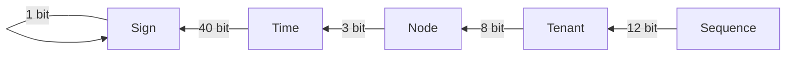

## 1. What is snowflakeid?
snowflakeid is a rapid and distributed unique id generator.

You can use snowflakeid to generate unique id of positive `long`.

Thre `long` result contains five parts, here is an example:

You can define bits of each part except `Sign` which is always `0`.

## How to use?
1. Add dependency
If you are using gradle 
```
implementation 'iorichina:spring-boot-starter-snowflakeid:1.1'
```
2. Use in `IOC`
```java
    @Autowired
    private SnowFlakeIdHelper snowFlakeIdHelper;
    @GetMapping("/snowflakeid")
    public Object snowflakeid() {
        long timeMillis = System.currentTimeMillis();
        return new HashMap<>() {{
            put("timeMillis", timeMillis);
            long id = snowFlakeIdHelper.genId(timeMillis);
            put("id", id);
            put("parseTimeInMillis", snowFlakeIdHelper.parseTimeInMillis(id));
        }};
    }
```
3. Get timestamp from snowflakeid
```java
long timestamp = snowFlakeIdHelper.parseTimeInMillis(id);
LocalDateTime ldt = snowFlakeIdHelper.parseTime(id);
```

## 2. How to config?
Configure in your `application.yml` file.
```yml
snowflakeid.startTime=2025-07-19T00:00:00
snowflakeid.timeUnit=MILLISECONDS
snowflakeid.tenantId=1
snowflakeid.nodeId=1
snowflakeid.bitsOfTime=40
snowflakeid.bitsOfTenant=3
snowflakeid.bitsOfNode=8
snowflakeid.bitsOfAutoincrement=12
snowflakeid.useCache=true
snowflakeid.maximumSize=1024
snowflakeid.recordStats=true
snowflakeid.recyclableLongMaxTry=1000
```

Here is the meaning of each configuration:
### 2.1. `startTime` 
- `startTime` is the base time of `Time` of snowflakeid. 
- We use `currentTime - startTime` to make `Time` smaller.
- So we can generate more ids in a long future. 
- Such as `40` bits of `Time` in `MILLISECONDS` can generate ids about 34 years.

### 2.2. `timeUnit` 
- `timeUnit` is the unit of `Time` of snowflakeid. 
- Valid values are `MILLISECONDS` `SECONDS` `MINUTES` `HOURS` `DAYS`

### 2.3. `tenantId` `nodeId`
`tenantId` and `nodeId` are used to generate distributed unique.

We use IPv4 address of current machine to generate a new `nodeId` if `-1 == nodeId`:
- get ipv4
- convert ipv4 to long
- get last `bitsOfNode` bits of ipv4 as `nodeId`
- make sure `nodeId = nodeId % (1 << bitsOfNode)`

### `bitsOf*`
`bitsOfTime` `bitsOfTenant` `bitsOfNode` `bitsOfAutoincrement` are used to define the bits of each part of snowflakeid.

### `useCache` `maximumSize` `recordStats`
We use loading-cache to get sequence of each unit of time.

Such as 1024 ms has 1024 sequence to generate recyclable long.

To make sure we could get autoincrement number from 0 every unit time.

### `recyclableLongMaxTry`
If you don't care about the autoincrement number start from 0 every unit time, you can set `useCache=false` and set `recyclableLongMaxTry` to a number.

We will use `RecyclableAtomicLong` to get a recyclable long as autoincrement number.

`RecyclableAtomicLong` is a thread-safe counter that can `getAndIncrementWithRecycle` between `0` and `1 << bitsOfAutoincrement`, and recycle to `0` when the autoincrement number is greater than `1 << bitsOfAutoincrement`.

It depends on CAS to recycle and will try max `recyclableLongMaxTry` times on CAS failure.

## Sample
### Default usage
Recording timestamp in millis
- sign bit(1)+
- time bits(default 40 with max 34 years in millis)+
- tenant bits(default 3 bits with max value 7)+
- node bit(default 8 bits with max value 255 generate by ipv4%255)+
- autoincrement(default 12 bits with max value 4095)

Default usage does not need to configure anything.
### Timestamp in Seconds 
Recording timestamp in seconds
- sign bit(1)+
- time bits(default 31 with max 68 years in seconds)+
- tenant bits(default 3 bits with max value 7)+
- node bit(default 8 bits with max value 255 generate by ipv4%255)+
- autoincrement(default 21 bits with max value 2,097,151)

config in your `application.properties`
```
snowflakeid.startTime=2025-04-19T00:00:00
snowflakeid.timeUnit=SECONDS
snowflakeid.bitsOfTime=31
snowflakeid.bitsOfTenant=3
snowflakeid.bitsOfNode=8
snowflakeid.bitsOfAutoincrement=21
snowflakeid.maximumSize=60
```
We set `maximumSize` to `60` because we need not to cache too much sequence.

### Special TenantId and NodeId
Recording timestamp in millis
- sign bit(1)+
- time bits(default 41 with max 68 years in millis)+
- tenant bits(default 3 bits with special tenantId)+
- node bit(default 4 bits with special nodeId)+
- autoincrement(default 15 bits with max value 32,767)

config in your `application.properties`
```
snowflakeid.startTime=2025-07-22T00:00:00
snowflakeid.tenantId=5
snowflakeid.nodeId=15
snowflakeid.bitsOfTime=41
snowflakeid.bitsOfTenant=3
snowflakeid.bitsOfNode=4
snowflakeid.bitsOfAutoincrement=15
snowflakeid.maximumSize=2000
```

## TODO list
- using dynamic `tenantId` and `nodeId` from outer source
